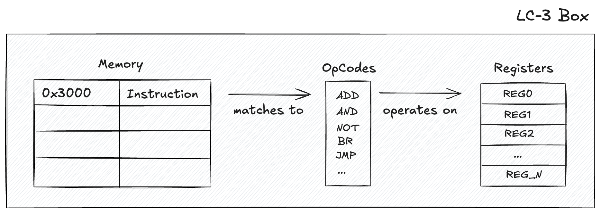

# LC3 Box

[](https://github.com/kobby-pentangeli/lc3box/actions)
[](https://crates.io/crates/lc3box)
[](https://github.com/kobby-pentangeli/lc3box/releases)
[](#license)

Toolbox for the [_Little Computer 3_ (LC-3)](https://en.wikipedia.org/wiki/Little_Computer_3) assembly language and instruction-set architecture. The goal is a complete LC-3 toolchain---assembler, disassembler, debugger, compiler, and virtual machine---sharing one instruction-set kernel.

Today the workspace ships that shared kernel and four tools---an assembler that turns LC-3 source into object files, a virtual machine that runs them, a disassembler that turns them back into readable assembly, and an interactive debugger that drives a program one instruction at a time---all driven through `lc3box`, a single command-line frontend; a compiler is planned.

## Status

| Component              | Crate      | Status    |
| ---------------------- | ---------- | --------- |
| Instruction-set kernel | `lc3core`  | Available |
| Virtual machine        | `lc3vm`    | Available |
| Assembler              | `lc3as`    | Available |
| Disassembler           | `lc3dsm`   | Available |
| Debugger               | `lc3debug` | Available |
| Unified CLI            | `lc3box`   | Available |
| Compiler               | `lc3c`     | Planned   |

## Project Structure

```text
lc3box/
├── lc3core/    # Library: shared instruction-set kernel---opcodes, registers, traps, memory map, .obj format
├── lc3as/      # Library: a two-pass assembler from .asm source to .obj object files
├── lc3dsm/     # Library: a disassembler decoding .obj objects into annotated, re-assemblable .asm
├── lc3vm/      # Library: a fetch–decode–execute virtual machine for .obj programs
├── lc3debug/   # Library: an interactive debugger driving the VM one instruction at a time
├── lc3box/     # Binary: the unified run/asm/disasm/dbg command-line driver over the five libraries
└── examples/   # LC-3 programs: .asm source and pre-assembled .obj
```

## Architecture



Every tool builds on `lc3core`, the single source of truth for the LC-3 instruction set: the opcode set, the register and condition-code model, the trap vectors, the memory-map constants, and the big-endian `.obj` object-file format. `lc3as` encodes assembly source into that object format, `lc3vm` loads an object file into a full 16-bit address space and runs it through the classic fetch–decode–execute loop pictured above, `lc3dsm` decodes an object file back into a re-assemblable listing, and `lc3debug` drives the VM one instruction at a time for interactive debugging---all going through `lc3core`, so every bit the assembler writes is the bit the VM decodes and the disassembler recovers. `lc3box` ties them together behind one command, dispatching `run`, `asm`, `disasm`, and `dbg` to the matching tool.

## Usage

Everything is driven through `lc3box`, with one subcommand per tool: `run`, `asm`, `disasm`, and `dbg`.

### Run a program

The [examples](examples) folder contains pre-assembled LC-3 programs (`.obj`) and assembly source (`.asm`). `run` executes either---a `.obj` is loaded directly, a `.asm` is assembled in memory first:

```sh
cargo run -p lc3box -- run examples/2048.obj
cargo run -p lc3box -- run examples/hello-world.asm
```

`2048` plays a terminal build of the game; `rogue` and `hello-world` are also included. Interactive programs place the terminal in raw mode for the duration of the run and restore it on exit.

### Assemble

Assemble an LC-3 source listing into an object file:

```sh
cargo run -p lc3box -- asm examples/hello-world.asm -o hello-world.obj
```

When `-o` is omitted, the object is written next to the source with a `.obj` extension. A program split across several `.ORIG`/`.END` segments---like [examples/bootstrap.asm](examples/bootstrap.asm)---is assembled into one object file per segment.

### Disassemble

Turn an object file back into a readable, re-assemblable listing, printed to standard output:

```sh
cargo run -p lc3box -- disasm examples/2048.obj
```

Each line shows its address and hex encoding as a trailing comment, labels are recovered from PC-relative references, and any word that is not a canonical instruction is rendered as `.FILL`. Use `-o`/`--output` to write the listing to a file. Paired with `asm`, `disasm` closes the round-trip---re-assembling a disassembled object reproduces the original image:

```sh
cargo run -p lc3box -- disasm examples/hello-world.obj -o hello-world.asm
cargo run -p lc3box -- asm hello-world.asm -o hello-world.obj
```

### Debug

Open an interactive debugging session on a program---a `.obj` is loaded directly, a `.asm` is assembled in memory first---then drive it from a prompt:

```sh
cargo run -p lc3box -- dbg examples/2048.obj
cargo run -p lc3box -- dbg examples/hello-world.asm
```

Single-step with `step [n]`, run to a breakpoint or `HALT` with `continue`, set and clear breakpoints with `break`/`delete`, inspect and edit registers and memory with `registers`/`set`/`write`, and disassemble around the program counter with `disassemble`; `help` lists every command and `quit` leaves. An executing program drives the terminal directly for the span of the run, while the prompt stays line-edited.

To install the `lc3box` command-line tool on your `PATH`---from crates.io, straight from the repository, or from a local checkout:

```sh
cargo install lc3box
cargo install --git https://github.com/kobby-pentangeli/lc3box
cargo install --path lc3box
```

To use the toolbox as a library, depend on the `lc3box` umbrella (reaching `lc3box::kernel`/`vm`/`asm`/`dsm`/`dbg`) or on an individual tool crate directly:

```sh
cargo add lc3box
cargo add lc3as
```

## Development

The workspace uses the Rust 2024 edition (Rust 1.88 or newer).

```sh
cargo +nightly fmt
cargo clippy --all-features --all-targets --workspace -- -D warnings
cargo build --release --all-features --all-targets
cargo test --all-features --all-targets --workspace
cargo doc --all-features --no-deps --workspace
```

## Contributing

Contributions are welcome! Please read our [Contributing Guidelines](CONTRIBUTING.md) and [Code of Conduct](CODE_OF_CONDUCT.md).

## License

Licensed under either of

- Apache License, Version 2.0 ([LICENSE-APACHE](LICENSE-APACHE) or <http://www.apache.org/licenses/LICENSE-2.0>)
- MIT license ([LICENSE-MIT](LICENSE-MIT) or <http://opensource.org/licenses/MIT>)

at your option.

Unless you explicitly state otherwise, any contribution intentionally submitted for inclusion in this codebase by you, as defined in the Apache-2.0 license, shall be dual licensed as above, without any additional terms or conditions.
